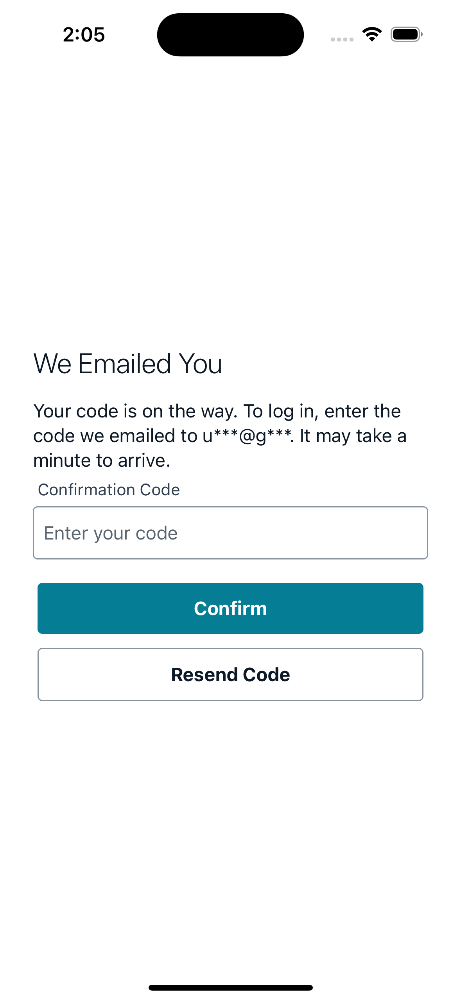
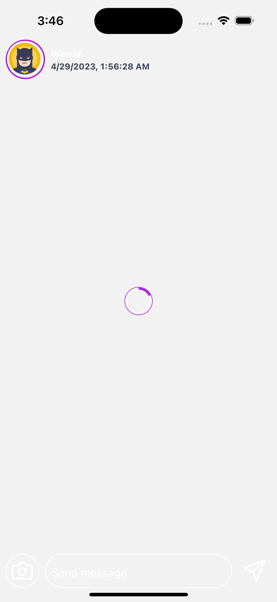

# Clone Of Instagram

# steps

1. create a new application by `npx create-expo-app instagram-clone`
2. add the web support npx expo `install react-dom react-native-web @expo/webpack-config`
3. add tailwind class name library `yarn add twrnc`
4. add tailwind config file for autocomplete add style to the class name in tailwind autocomplete `npx tailwindcss init`
5. add React Navigation both native and stack `yarn add @react-navigation/native @react-navigation/stack @react-navigation/bottom-tabs`

6. add expo react navigation decencies by `npx expo install react-native-screens react-native-safe-area-context`

7. add gesture handle by `npx expo install react-native-gesture-handler`

8. add amplify `npm install aws-amplify amazon-cognito-identity-js @react-native-community/netinfo @react-native-async-storage/async-storage core-js`

9. init the amplify `amplify init`

10. add amplify auth `amplify add auth`

- select Default configuration.
- select username as the default auth
- yes i am done -
- then `amplify push`
- yes

11. add to app.js

```
import { Amplify, Auth } from 'aws-amplify';
import awsconfig from './aws-exports';
Amplify.configure(awsconfig);
```

12. add aws-amplify-ui

```
yarn add @aws-amplify/ui-react-native aws-amplify react-native-safe-area-context amazon-cognito-identity-js @react-native-community/netinfo @react-native-async-storage/async-storage react-native-get-random-values react-native-url-polyfill

```

- in app.js

```
import { Authenticator, useAuthenticator } from "@aws-amplify/ui-react-native";
<Authenticator.Provider>
      <Authenticator>

       </Authenticator>
    </Authenticator.Provider>
```

13. add api with amplify with `amplify add api`

- we use graphQl
- then select provide api name : instagram-clone
- then select authorization type for api as api key
- description for api could be anything
- days for api key to expire : 365
- configure more auth type :n
- select One-to-many relationship
- do you want to edit scheme : n

14. add the schema to amplify schema.graphql then
    `amplify push`

- Generate code : yes
- language :javascript or typescript
- generate file :yes
- statement depth :2

15. `amplify console api` or `amplify mock api`

16. add react-native-progress and react native image progress
    `yarn add react-native-progress react-native-image-progress `

# preview

| Login                        | Send Code                    | Home                         |
| ---------------------------- | ---------------------------- | ---------------------------- |
|  |  |  |
|  |  |
